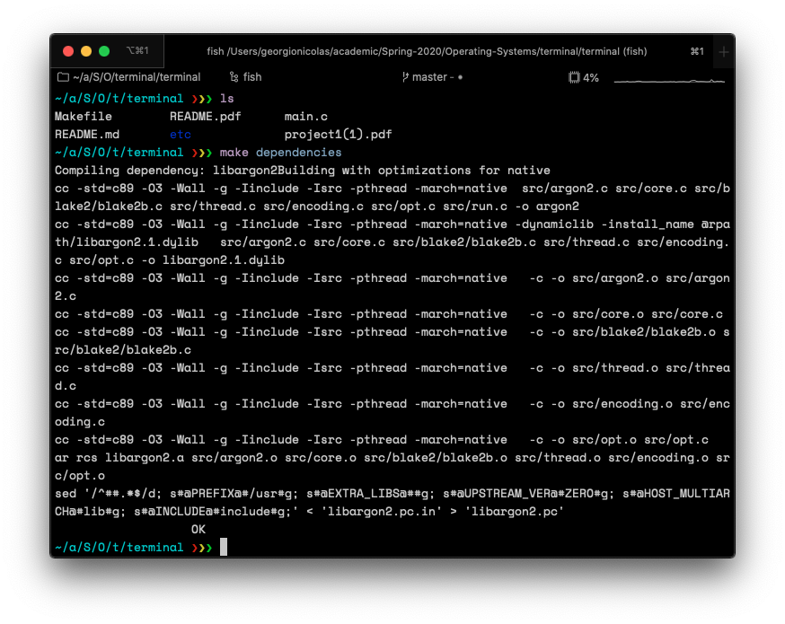
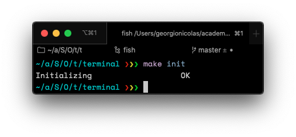
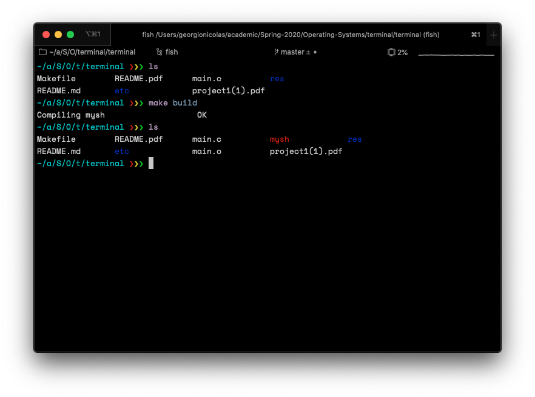
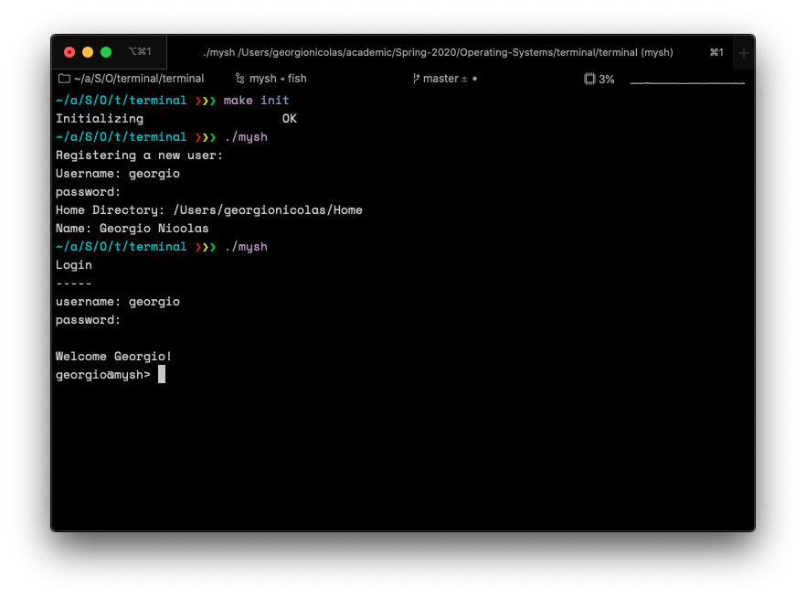
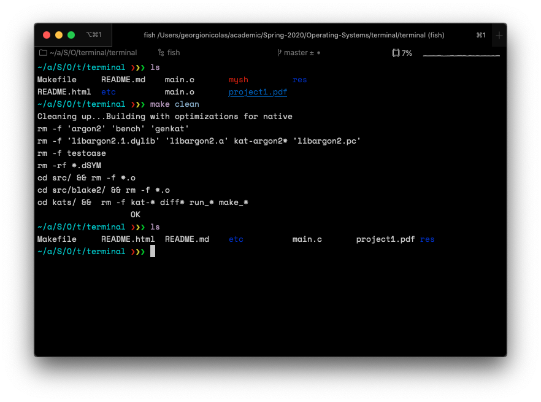

# Project 1: mysh

## Introduction

My implementation of mysh is a basic command interpreter. It can generally execute any executable found in the user executing the binary's path. It also supports piping output from one executable to another for up to to 3 executables.

Basic user authentication is also provided. User passwords are hashed using [Argon2](https://password-hashing.net/#argon2) and a random salt seeded from `dev/urandom`. User data is stored inside the project root, under `etc/passwd`. Another file `etc/util` is used to keep track of the number of users registered.

## List of Features

| Feature Name               |   Command   |                           Status |
| :------------------------- | :---------: | -------------------------------: |
| List files and directories |    `ls`     |                          Working |
| Grep                       |   `grep`    |                          Working |
| Print working directory    |    `pwd`    |                          Working |
| Change directory           | `cd [path]` |                          Working |
| Adding a user              | `add_user`  | Partially Working (only on init) |
| Login                      |      -      |                          Working |
| Exiting                    |   `exit`    |                          Working |
## Manual

### Installation

#### 1- Dependencies

This project depends on `libargon2`, a password hashing library. The source code of this library needs to be compiled before `mysh` is compile. To do that simply run `make dependencies` from the project root folder.

#### 2- User Database Initialization

To initialize the database of user data, run `make init` from the project root folder. This delete any previously saved users. This command can be run at any given time should you wish to re-initialize the program or clear user data.

​								

#### 3- Compiling The Project

To compile this project, run `make build` in the project root directory. The outputs will be an intermediary binary `main.o`, and the main executable `mysh`. The project will be compiled using `gcc`.

#### 4- Running The Executable

To run mysh, execute the following command from the project root folder `./mysh`.

When running for the first time after initialization, you will be prompted to register a user. Otherwise, you will be directed to the login page right away.

#### 5- Cleaning Up

To remove the compiled files for `libagron2` and the project, simply run `make clean`.
Note that the user database will remain persistent under `etc/passswd`. To remove user data refer to part 3 of the manual.

## Correctness Testing

I have performed some tests which can be reproduced. The tests and results can be found in the screenshot below.

